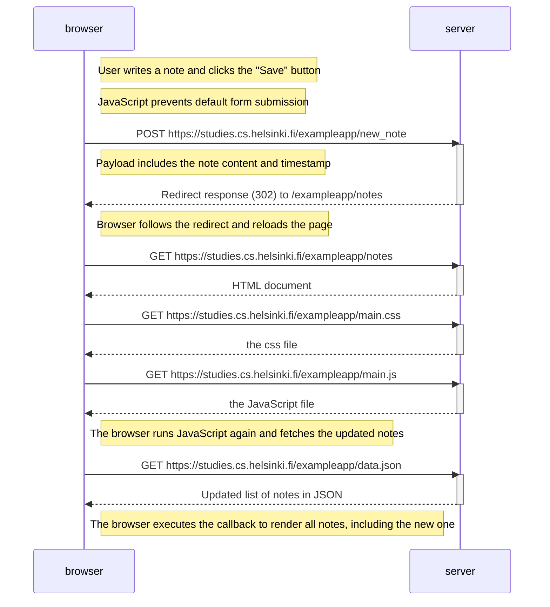

```mermaid
sequenceDiagram
    participant browser
    participant server

    Note right of browser: User writes a note and clicks the "Save" button

    Note right of browser: JavaScript prevents default form submission

    browser->>server: POST https://studies.cs.helsinki.fi/exampleapp/new_note
    activate server
    Note right of browser: Payload includes the note content and timestamp
    server-->>browser: Redirect response (302) to /exampleapp/notes
    deactivate server

    Note right of browser: Browser follows the redirect and reloads the page

    browser->>server: GET https://studies.cs.helsinki.fi/exampleapp/notes
    activate server
    server-->>browser: HTML document
    deactivate server

    browser->>server: GET https://studies.cs.helsinki.fi/exampleapp/main.css
    activate server
    server-->>browser: the css file
    deactivate server

    browser->>server: GET https://studies.cs.helsinki.fi/exampleapp/main.js
    activate server
    server-->>browser: the JavaScript file
    deactivate server

    Note right of browser: The browser runs JavaScript again and fetches the updated notes

    browser->>server: GET https://studies.cs.helsinki.fi/exampleapp/data.json
    activate server
    server-->>browser: Updated list of notes in JSON
    deactivate server

    Note right of browser: The browser executes the callback to render all notes, including the new one
```
