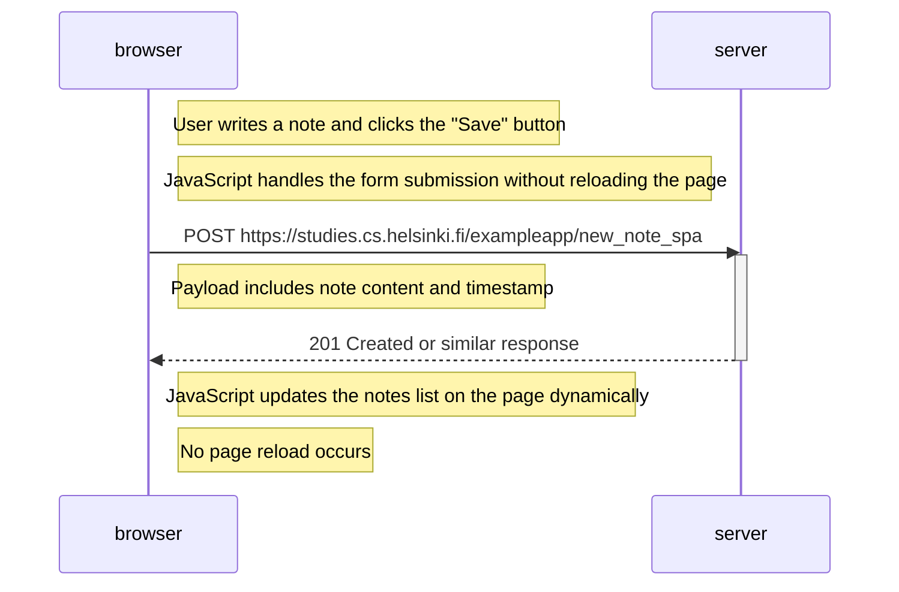

```mermaid
sequenceDiagram
    participant browser
    participant server

    Note right of browser: User writes a note and clicks the "Save" button

    Note right of browser: JavaScript handles the form submission without reloading the page

    browser->>server: POST https://studies.cs.helsinki.fi/exampleapp/new_note_spa
    activate server
    Note right of browser: Payload includes note content and timestamp
    server-->>browser: 201 Created or similar response
    deactivate server

    Note right of browser: JavaScript updates the notes list on the page dynamically

    Note right of browser: No page reload occurs
```
